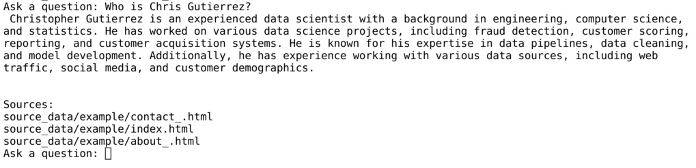
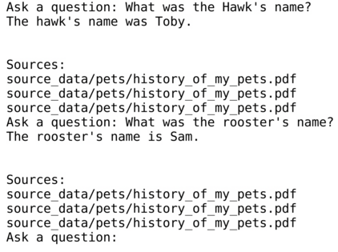

# Ask-The-Docs
## About Ask-The-Docs
This simple set of programs allows you to ask a chatbot about local documents. It assumes a GPU.
Using the Hugging Face models, it can be entirely local, with no internet required. The computer it runs on should be robust for any non-trivial models. I only worked with quantized models. 
Using OpenAI, the computer requirements are minimal, but it uses an API. There is an API cost, and the internet is required. 
The starting values are non-optimal. The emphasis was on simplicity. 
## Installation
Clone the repo, cd into it, install fresh conda environment with python >=3.10, then pip install the requirements.
```
git clone https://github.com/christophergutierrez/Ask-The-Docs.git
cd Ask-The-Docs/
conda create -n atd python=3.10
conda activate atd
pip install -r requirements.txt
```
## Running
We must choose whether to go to the Hugging Face or the OpenAI route.
### Hugging Face Example:
We'll make the Hugging Face config the one to use. Then, ingest the data to persistent storage and ask questions related to the documents. The models may take a while to load, especially if they need to download the models.
```
cp config_hf.py config.py
python ingest.py
python ask.py
```

### OpenAI Example:
We'll make the OpenAI config the one to use. Then, ingest the data to persistent storage and ask questions related to the documents.
Don't forget 
`export OPENAI_API_KEY="your_key"`

```
cp config_oai.py config.py
python ingest.py
python ask.py
```

<br>This is bare-bones, but it should be enough to get started.
